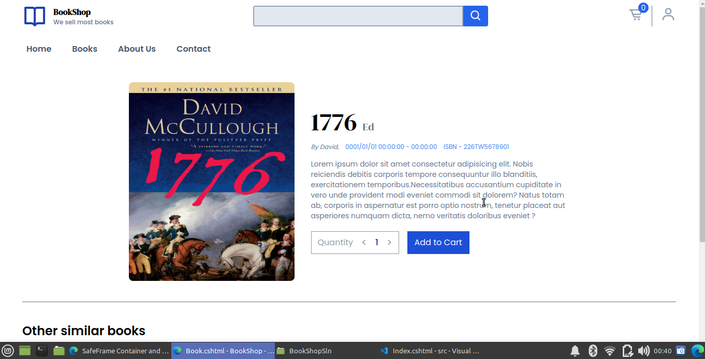

# Book Shop

## Description

Book Shop developed using asp.net core, tailwindcss and jquery/javascript.

## Features

- Add/View/Delete books
- Filter/Search/Order/Pagination books
- Add/Delete books from Cart
- View Cart

# Documentation

## Run project

- dotnet restore --project ./BookShop/BookShop.csproj
- update connection string & add your own database then do migrations & database update
- dotnet run

## Book Add/View/Delete(TODO)
- book/

- book/details/{id}

## Cart View

- cart/

## Account Register/Login/Reset password

- account/login

- account/signup

- account/password/reset_password
- TODO

## Account View/Update/Change password/Delete(TODO)
