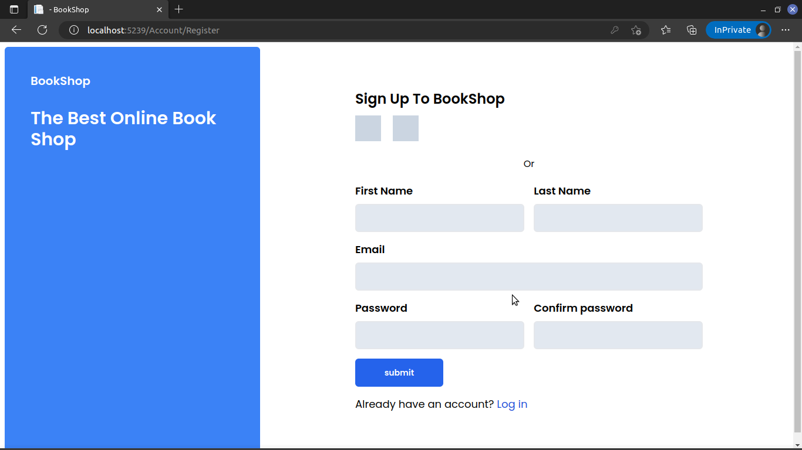

# Book Shop

## Description

Book Shop developed using asp.net core, tailwindcss and jquery/javascript.

## Features

- Add/View/Delete books
- Add/Delete books from Cart(TODO)
- View Cart(TODO)

# Documentation

## Run project

- dotnet restore --project ./BookShop/BookShop.csproj
- update connection string & add your own database then do migrations & database update
- dotnet run

## Shot Add/View/Delete(TODO)
- book/

- book/details/{id}

## Account Register/Login/Reset password

- account/login

- account/signup

- account/password/reset_password
- TODO

## Account View/Update/Change password/Delete(TODO)
